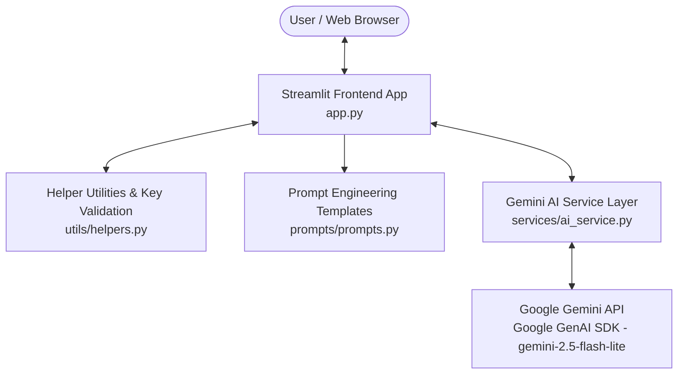

# FocusFlow AI ⚡

> **AI-Powered Productivity Assistant** — Built for the Innovation Hacks AI Internship 2026.

FocusFlow AI is a professional, modular Streamlit web application designed to help students, professionals, and general users analyze, summarize, generate content, and interact with text far more efficiently using Google Gemini AI (`gemini-2.5-flash-lite`).

---

## 📌 Problem Statement

In today's fast-paced digital environment, users spend excessive time manually digesting long articles, drafting repetitive emails, analyzing document structure and tone, and extracting actionable next steps from raw meeting notes. Generic conversational chatbots often require tedious prompt setup and lack structured workflows tailored for daily productivity tasks.

---

## 💡 Solution

**FocusFlow AI** provides a dedicated, structured productivity suite with five specialized AI capabilities. By isolating prompt engineering and embedding domain-specific guidance into a clean Streamlit interface, FocusFlow AI delivers immediate, high-quality, reproducible text transformations without manual prompt overhead.

---

## ✨ Core Capabilities

1. **📝 Text Summarization**: Generate high-impact `Bullet Points`, a single tight `Concise Summary`, or a multi-paragraph `Executive Summary`.
2. **❓ Question Answering (Ask AI)**: Get accurate, direct answers to general questions or ground responses using optional reference context. States limitations clearly when context is insufficient.
3. **✍️ Content Generation**: Draft `Email`, `Study Notes`, `Blog Outline`, `Social Media Post`, or `Professional Description` with customizable Tone (`Professional`, `Casual`, `Academic`, `Concise`, `Persuasive`) and Target Length (`Short`, `Medium`, `Detailed`).
4. **🔍 Text & Document Analysis**: Receive structured critique including `Main Topic`, `Key Points`, `Important Observations`, `Strengths`, `Areas for Improvement`, and `Overall Assessment`.
5. **💡 Intelligent Suggestions**: Turn raw context into actionable, prioritized recommendations categorized into `Immediate Action Items`, `Strategic Recommendations`, and `Follow-up Questions`.

---

## 🤖 Gemini AI Model

- **Primary Model**: `gemini-2.5-flash-lite`
- **SDK**: Official [`google-genai`](https://pypi.org/project/google-genai/) Python SDK with fallback support for `google-generativeai`.
- **Optimization**: Configured with low latency and cost efficiency to maximize quota availability.
- **Resiliency**: Built-in rate limit (429) interceptor with sanitized user messaging.

---

## 🛠️ Technology Stack

- **Core Language**: Python 3.10+
- **Frontend Framework**: [Streamlit](https://streamlit.io/) (Vanilla CSS modern dark theme)
- **AI SDK**: Official [Google GenAI SDK](https://pypi.org/project/google-genai/) (`google-genai`)
- **Environment Management**: `python-dotenv`
- **Version Control**: Git & GitHub

---

## 🏛️ System Architecture

FocusFlow AI follows a clean, decoupled 3-tier architecture separating user interface, AI client orchestration, prompt engineering templates, and environment utilities.



---

## 📁 Directory Structure

```
focusflow-ai/
│
├── app.py                  # Main Streamlit application UI & navigation
├── requirements.txt        # Application dependencies
├── .env.example            # Environment variables template
├── .gitignore              # Git ignore rules for secrets and build files
├── README.md               # Project documentation
│
├── docs/
│   └── screenshots/        # Application screenshot assets & checklist
│       └── README.md
│
├── services/
│   ├── __init__.py
│   └── ai_service.py       # Gemini API client wrapper & error handling
│
├── prompts/
│   ├── __init__.py
│   └── prompts.py          # Structured prompt templates & constants for all 5 modes
│
└── utils/
    ├── __init__.py
    └── helpers.py          # Environment configuration, API validation & text utilities
```

---

## 🚀 Setup & Installation

### 1. Prerequisites
Ensure **Python 3.10 or higher** is installed on your system.

### 2. Clone Repository
```bash
git clone https://github.com/rishabhjain071130-glitch/focusflow-ai.git
cd focusflow-ai
```

### 3. Create Virtual Environment
```bash
# On Windows
python -m venv venv
venv\Scripts\activate

# On macOS/Linux
python3 -m venv venv
source venv/bin/activate
```

### 4. Install Dependencies
```bash
pip install -r requirements.txt
```

---

## 🔑 Environment Configuration

1. Obtain a **Google Gemini API Key** from [Google AI Studio](https://aistudio.google.com/).
2. Copy `.env.example` to create `.env`:
   ```bash
   # Windows PowerShell
   copy .env.example .env

   # Linux / macOS
   cp .env.example .env
   ```
3. Open `.env` and set your API key:
   ```env
   GEMINI_API_KEY=your_actual_gemini_api_key_here
   ```

---

## 💻 Usage & Running Locally

Start the Streamlit development server:

```bash
streamlit run app.py
```

The application will launch automatically in your default browser at `http://localhost:8501`.

---

## 🌐 Deployment (Streamlit Community Cloud)

FocusFlow AI is optimized for cloud deployment on **Streamlit Community Cloud**:

1. Fork or push this repository to GitHub.
2. Log into [Streamlit Community Cloud](https://streamlit.io/cloud).
3. Click **New app** and select repository `focusflow-ai`, branch `main`, and main file `app.py`.
4. Under **Advanced settings... -> Secrets**, configure your API key securely:
   ```toml
   GEMINI_API_KEY = "your_actual_gemini_api_key_here"
   ```
5. Click **Deploy**.

---

## 📷 Screenshots & Visual Checklist

Screenshots and UI verification assets are organized in [`docs/screenshots/`](docs/screenshots/README.md).

- **Landing Dashboard**: Glassmorphism dark mode with hero metrics grid.
- **AI Connected Status**: Live connection status indicator in sidebar.
- **Mode Workspaces**: 2-column layout for Summarize, Ask AI, Generate Content, Analyze Text, and Smart Suggestions.

---

## 🛡️ Security & Secret Management

- **No Hardcoded Keys**: API keys are retrieved strictly via environment variables (`GEMINI_API_KEY`).
- **Git Protection**: `.gitignore` is explicitly configured to block `.env`, `.env.local`, and secrets from ever being tracked.
- **Verification**: Verified using `git check-ignore` and `git ls-files`.

---

## ⚠️ Error Handling & Resiliency

- **Input Validation**: Prevents blank submissions and prompts users with clear inline warnings (`Please enter some text before continuing.`).
- **Graceful Failure**: Intercepts 429 rate limit and auth errors cleanly with sanitized messages (`AI usage limit reached. Please try again later.`).
- **Zero Raw Exceptions**: Prevents stack traces, local paths, or internal variables from reaching the user interface.

---

## 📄 License
Created for **Innovation Hacks AI Internship 2026**.
